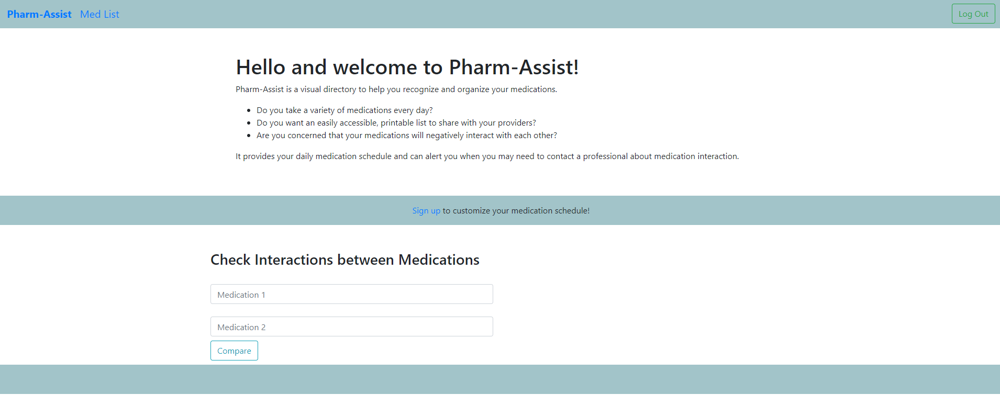

# Pharm-Assist

  

  

Pharm-Assist is deployed here:  https://
  

## Description
Pharm-Assist is an app designed to assist users in managing their medications.  Phar-Assist allows users to:

* Regularly update medications and daily schedules
* Conveniently print an up-to-date list of medications for dosage and sharing with providers
* Quickly check medications for dangerous interactions with each other
* Easily drug prices at local pharmacies by zipcode
  

## Table of Contents
  * [Technologies](#technologies)
  * [Installation](#installation)
  * [Usage](#usage)
  * [Collaborators](#collaborators)
    

## Technologies
* GraphQL
* React
* React-toPrint
* NPM packages
* JWT (authentication)
* Axios for API calls
* National Institute of Health - RxNorm API
* National Institute of Health - Drug Interaction API

 

## Installation
This repository can be cloned by using the following command:
~~~
gh repo clone 
~~~

Then, install using the command:
~~~
npm install
~~~

 

## Usage
To run the app locally, use the command:
~~~
npm run develop
~~~

 

## Collaborators
* Anam Brazik  https://github.com/abrazik
* Bernie McKnight  https://github.com/sissyhanks
* Judy Motha  https://github.com/JudyMotha
* Lance Bailey  https://github.com/lancebailey26
* Raemarie Oatman  https://github.com/rmoatman